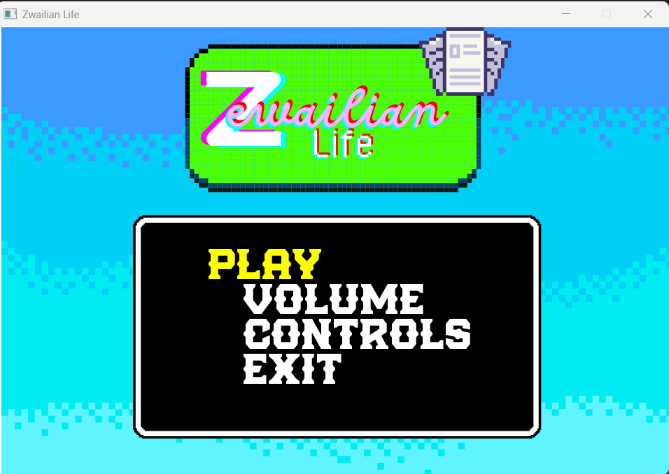

# Zewailian Life

An immersive 2D simulation game built with C++ and SFML (Simple and Fast Multimedia Library). Experience a virtual world where you can interact with characters, explore environments, and complete various objectives.

## Overview

- Game menu

- Enter player name

- Select your character

- Game intro

- Enjoy the game

## Features

### Main Menu
- Intuitive navigation with highlighted selection
- Player name input functionality
- Smooth transitions between menu states
- Options for starting the game, viewing controls, and exiting

### Game World
- Dynamic 2D environment with collision detection
- Interactive map with boundaries
- Smooth character movement and controls
- Day/Night cycle (planned)

### Characters
- Player character with customizable name
- NPCs with basic AI for interaction
- Character animations and sprites

### Items & Inventory
- Collectible items throughout the world
- Inventory system
- Item interaction mechanics

### Audio
- Background music with loop control
- Sound effects for actions and events

## Technical Implementation

### Main Menu System
- `sf::Text mainMenu[]` - Array of menu options
- `int selected` - Tracks current menu selection
- `std::string name` - Stores player's name
- Event handling for navigation and selection

### Map System
- `sf::Sprite` for background rendering
- Texture management with `sf::Texture`
- Collision detection with map boundaries
- Dynamic loading of map assets

### Player Mechanics
- Position tracking with `x` and `y` coordinates
- Movement system with adjustable speed
- Collision detection with window boundaries
- Sprite and texture management

### Cutscenes
- Scripted sequences with `sf::Sprite`
- Texture and animation handling
- Event-based progression

### Sound System
- `sf::Music` for background music
- Playback controls (play, stop, loop)
- Volume management

## Game Assets

| Asset Type | Preview | Description |
|------------|---------|-------------|
| Player Sprite |  | Main characters sprite |
| Map Tileset |  | Game world tiles |
| UI Elements |  | Menu and HUD elements |
| Items |  | Collectible items |

## Getting Started

### Prerequisites
- C++17 or later
- SFML 2.5.1 or later
- CMake 3.15 or later (for building from source)

## Controls
- **WASD/Arrow Keys**: Move character
- **E**: Interact with objects/NPCs
- **ESC**: Open menu/pause game
- **Enter**: Confirm selection

## 📝 License
This work is licensed under a [Creative Commons Attribution-NonCommercial-NoDerivatives 4.0 International License](http://creativecommons.org/licenses/by-nc-nd/4.0/).

### You are free to:
- **Share** — copy and redistribute the material in any medium or format

### Under the following terms:
- **Attribution** — You must give appropriate credit, provide a link to the license, and indicate if changes were made.
- **NonCommercial** — You may not use the material for commercial purposes.
- **NoDerivatives** — If you remix, transform, or build upon the material, you may not distribute the modified material.

## 🙏 Acknowledgments
- SFML Development Team for the amazing multimedia library
- All contributors and testers
- Zewail City community for inspiration